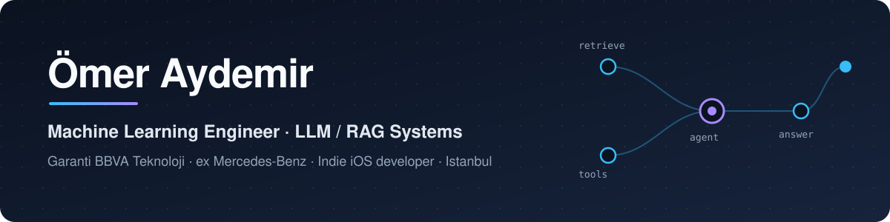
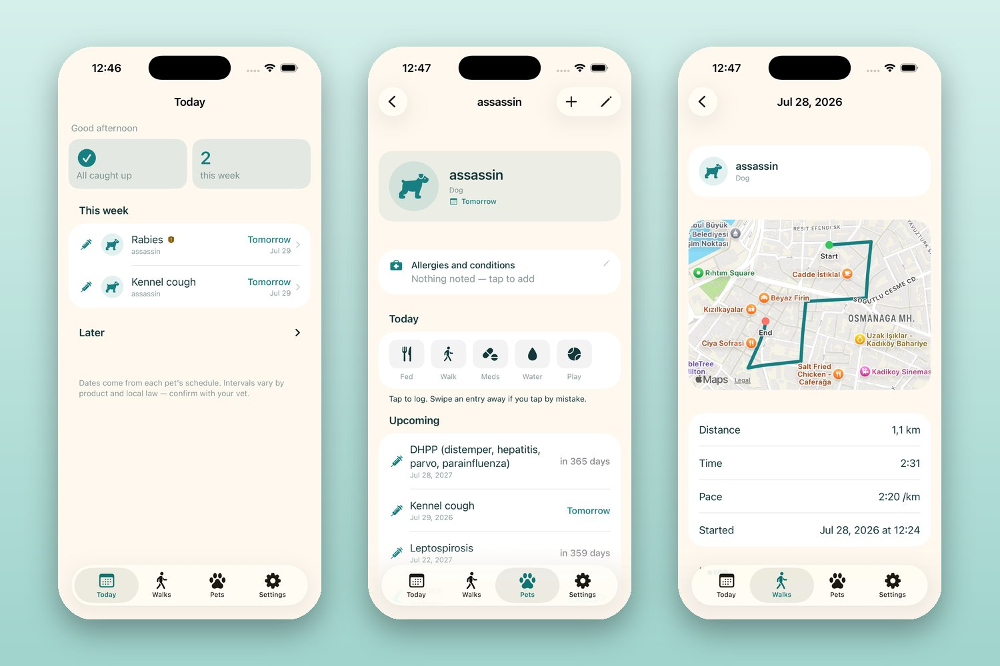
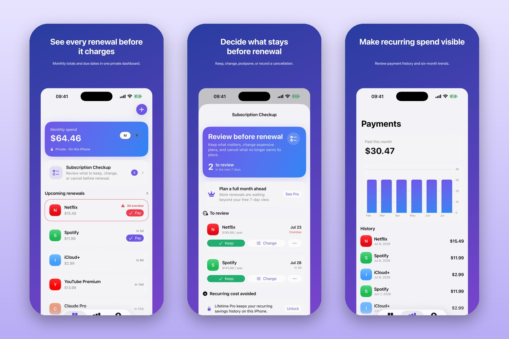
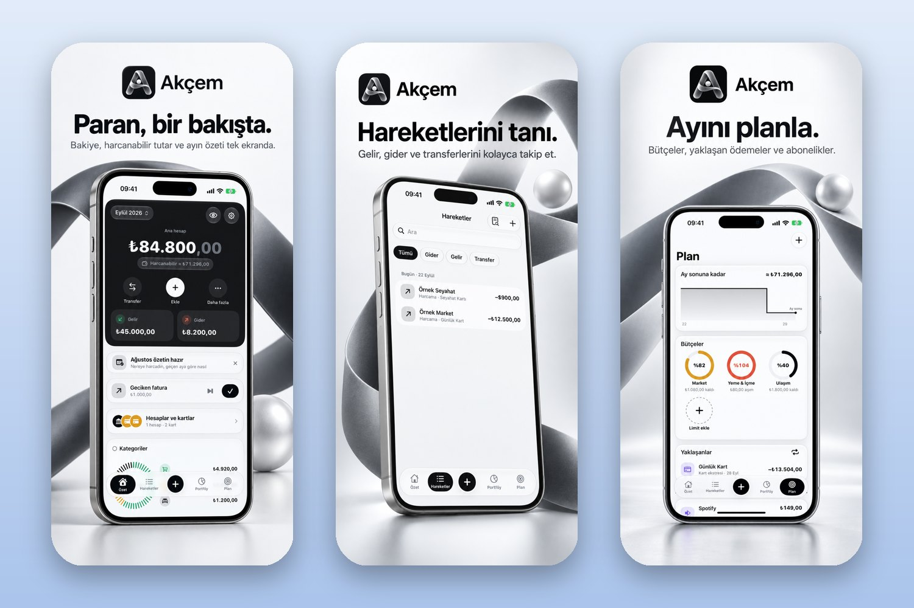

  

  
  
  
  

I build LLM systems that run in production, not just in notebooks. I'm a **Machine Learning Engineer at Garanti BBVA Teknoloji**, applying AI/ML to core banking workflows. Before that I spent two and a half years at **Mercedes-Benz Otomotiv**, first as a backend engineer and then as an AI engineer, shipping conversational agents and RAG platforms that handled **10,000+ transactions a month**.

Outside work I design, build and ship **native iOS apps on my own**, using AI coding agents to move fast without cutting corners on tests.

<!-- Uncomment when you want this public:
🌍 Open to ML / AI Engineer roles in Europe (EU Blue Card–eligible).
-->

## 🧠 AI systems I've shipped

| | What it is | Stack |
|---|---|---|
| **SWT AI Chatbot** Mercedes-Benz USA | Agentic assistant for SAP operations in Microsoft Teams: MSRP queries, purchase-order actions, consignment reversals. Circuit breakers, Redis session cache, MongoDB persistence. | LangGraph · GPT-4 · FastAPI · Azure Bot Service · Kubernetes |
| **Insight Generator** Mercedes-Benz | RAG platform for natural-language Q&A over Excel, PowerPoint and PDF files, with MMR multi-turn retrieval, KPI detection and Azure Data Lake integration. | Docling OCR · ChromaDB · GPT-5 · Python |
| **Ontll** Mercedes-Benz | Production RAG chatbot over PDF knowledge bases; modernized a legacy system for speed. | LangChain · Azure OpenAI |
| **Centralized Configuration Service** Mercedes-Benz | Global environment-configuration platform with versioning for complex data blocks, delivered with GitOps. | Java · Spring Boot · Kafka · ArgoCD · GitHub Actions |

Company code is private. Happy to walk through the architecture and trade-offs in a conversation.

## 📱 Indie iOS apps

<table>
<tr>
<td width="96" valign="top"></td>
<td valign="top">
<b>Patizi</b> · Vaccine reminders and health records for your pets 
 
Region-aware vaccine schedules (TR / DE), a notification planner that never drops reminders, GPS walk tracking, widgets. Local-first: no account, no server, no analytics. Localized in 4 languages. 
<b>SwiftUI · SwiftData · WidgetKit · CoreLocation · StoreKit 2</b> · logic in a modular Swift package with DST- and leap-day-safe recurrence tests.
</td>
</tr>
</table>

<table>
<tr>
<td width="96" valign="top"></td>
<td valign="top">
<b>Subscker</b> · A private subscription tracker 
 
Track renewals and spending, run a “subscription checkup”, keep payment history. No bank linking, no cloud, no tracking. Lifetime Pro via in-app purchase. Localized in 4 languages. 
<b>SwiftUI · SwiftData · StoreKit 2 · Swift Charts · App Intents</b>
</td>
</tr>
</table>

<table>
<tr>
<td width="96" valign="top"></td>
<td valign="top">
<b>Akçem</b> · Personal finance, in one place (coming soon) 
 
Accounts, transactions, budgets, payment plans, portfolio and credit-card statement import (PDF). Private iCloud sync, no ads, no third-party tracking. 
<b>SwiftUI · SwiftData · WidgetKit · App Intents · PDFKit · Swift Charts</b> · 330+ Swift files, ~100 test files.
</td>
</tr>
</table>

## 🛰️ Open-source project: STRATYON

A strategic-intelligence platform for the Turkish market: geographic intelligence (GEOINT) heatmaps, AI-generated marketing strategies, competitor keyword-gap analysis and Turkish NLP.

| Repo | Part | Stack |
|---|---|---|
| [geoint-backend](https://github.com/omeraydmr/geoint-backend) | v1 API and intelligence engine | FastAPI · PostgreSQL + PostGIS · Redis · LangChain · OpenAI / Anthropic · GitHub Actions → AWS ECR |
| [geoint-frontend](https://github.com/omeraydmr/geoint-frontend) | v1 dashboards and maps | Next.js 15 · React 19 · TypeScript · Mapbox GL |
| [stratyonv2-backend](https://github.com/omeraydmr/stratyonv2-backend) | v2 report-analysis API | Java 21 · Spring Boot 3 · PostgreSQL · Flyway · S3 · JWT |
| [stratyonv2-frontend](https://github.com/omeraydmr/stratyonv2-frontend) | v2 web app | Next.js 16 · React 19 · TanStack Query · Zod · Tailwind |

## 🧰 Toolbox

**AI / ML**&nbsp;      

**Backend & data**&nbsp;      

**Cloud & DevOps**&nbsp;      

**Apps & web**&nbsp;     

---

BSc Information Systems & Technologies, Yeditepe University (honors, full scholarship) · Turkish (native), English · Istanbul

